

  <h1>Gravitational Waves</h1>
  
Physics, Detection, and Analysis of GW150914

  
Emil Ma · Mentor: Norm Prokup

  
December, 2025

## What Are Gravitational Waves?

Gravitational waves (GWs) are ripples in spacetime produced by accelerating masses, analogous to how accelerating electric charges produce electromagnetic waves. They were first predicted by **Albert Einstein** in 1916 as part of General Relativity.
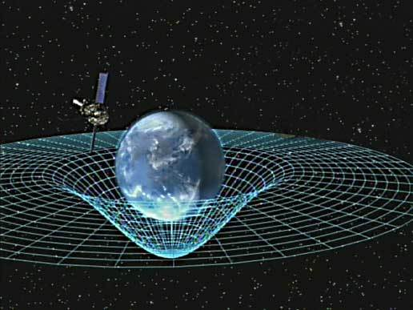

### Historical Notes
- First indirect evidence: [Hulse and Taylor binary pulsar (1974)](https://articles.adsabs.harvard.edu/pdf/1975ApJ...195L..51H)
- First direct detection: [**GW150914** by LIGO (2015)](https://www.ligo.caltech.edu/page/press-release-gw150914). In the GW150914 event, two black holes with masses of approximately 36 and 29 solar masses spiraled toward each other and merged to form a single black hole of about 62 solar masses. The remaining mass, roughly 3 solar masses, was converted directly into energy and emitted as gravitational waves, according to Einstein’s relation for energy.  

### How LIGO Detects Gravitational Waves

The [Laser Interferometer Gravitational-Wave Observatory (LIGO)](https://www.ligo.caltech.edu/page/ligos-ifo) detects
gravitational waves using a Michelson interferometer with two
perpendicular arms, each 4 km long.

A passing gravitational wave stretches spacetime in one direction while
compressing it in the perpendicular direction. As a result, the relative
lengths of LIGO’s two arms change by a tiny amount.

Laser light is split and sent down both arms, reflected by mirrors, and
recombined. When the arm lengths change, the returning light waves shift
out of phase, producing an interference pattern that is measured as
**strain**: how much the detector’s arm lengths change due to a passing gravitational wave.

It is defined as the change in length of the arms, 
ΔL(t), divided by the original arm length, 
L.

For astrophysical sources, the measured strain is extremely small,
typically on the order of 10^-21.

# Project: Analyzing GW150914 Data

In the following sections, I analyze publicly available [LIGO strain data](https://gwosc.org/)
from the first detected gravitational-wave event, GW150914, and recreate
the key steps used to identify the signal from detector noise. The order of analysis follows the final project of MITxT 8.S50.1x "Computational Data Science in Physics I," and plots were independently implemented.

---

## 1. Raw Strain Time Series

This plot shows the LIGO strain h(t) over time in a 32-second window centered on the GW150914 event.

  <!-- your saved figure -->

**How I made the plot was made:**  
- Data consist of time-stamped measurements of the relative length changes in LIGO’s two perpendicular arms.
- Using Python (NumPy and Matplotlib), I loaded the data were, extracted a 32-second window around the merger, and plotted the strain values versus time.

**What the plot shows:**
- x-axis: time (s) around the merger  
- y-axis: strain (dimensionless), quantifying the fractional change in arm length

**Interpretation:**
- At this stage, the gravitation-wave signal is buried in mainly seismic noise.
- Subsequent steps to clean up the data will reveal the true gravitational-wave signal hidden in these noisy measurements.

---

## 2. Amplitude Spectral Density (ASD)

The amplitude spectral density shows how much noise the detector has at each frequency.

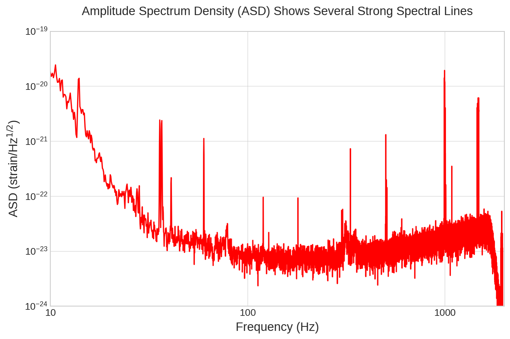  
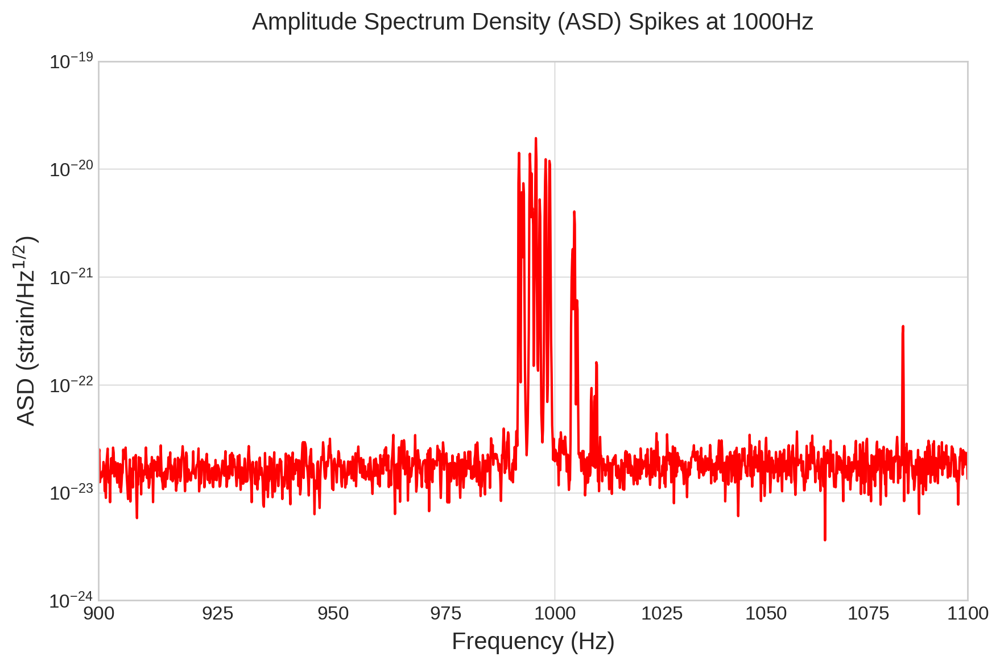

**How I made the plot:**  
- I transformed the raw strain data from the time domain to the frequency domain using a [Fast Fourier Tranform (FFT)](https://www.sciencedirect.com/topics/engineering/fast-fourier-transform). 
- Using NumPy, SciPy, and Matplotlib, I compute the ASD as the square root of the power spectral density (PSD), giving a measure of the strain amplitude per unit frequency.

**What the plot shows:**
- The x-axis represents frequency (Hz).
- The y-axis represents the amplitude of the strain noise (strain/√Hz).
- Peaks in the ASD indicate frequencies where noise is stronger, such as mechanical vibrations, electronic noise, or laser fluctuations.
- The zoomed-in plot highlights the frequency band where LIGO is most sensitive and where the gravitational-wave signal is expected.

**Interpretation:**
- Low frequencies (<30 Hz) are dominated by seismic motion, while high frequencies (>500 Hz) are limited by photon shot noise in the laser.
- LIGO’s optimal sensitivity is in the 100–300 Hz range, which coincides with the strongest emission frequencies for binary black hole mergers like GW150914.
- Understanding the ASD is crucial because it tells us which frequencies are reliable for detecting astrophysical signals and which regions are dominated by noise.
- This information guides later steps such as whitening and bandpass filtering, which enhance the visibility of the gravitational-wave signal.

---

## 3. Whitening the Data

Whitening adjusts the data so that noise has roughly the same strength across all frequencies, making it easier to see short-lived signals like gravitational-wave chirps.

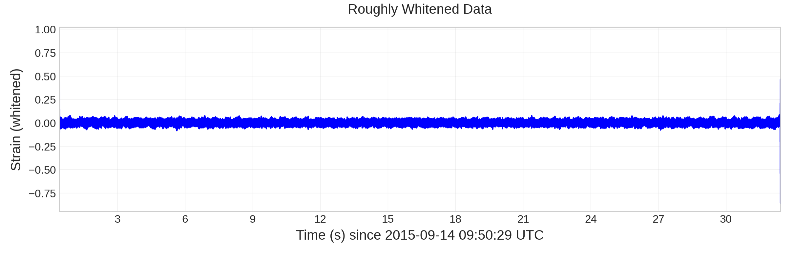  
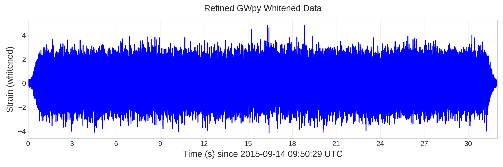

**How I made the plot:**  
- I transformed the raw strain data from time to frequency using a Fourier transform.
- The amplitude of the noise at each frequency (the ASD) was calculated.
- I divide the data in the frequency domain by the ASD to flatten the noise.
- Then I transform the data back to the time domain, producing the “whitened” signal.
- The Python GWpy library helps with windowing, overlapping segments, and correct scaling.

**What the plot shows:**
- x-axis: time (seconds) around the GW150914 merger event
- y-axis: whitened strain (dimensionless, now scaled so that noise is roughly uniform across frequencies)
- The noise floor appears more flat and uniform, without dominating low- or high-frequency peaks

**Interpretation:**
- Whitening makes the gravitational-wave signal easier to detect because it removes frequency-dependent variations in the noise.
- Before whitening, low-frequency seismic noise and high-frequency shot noise dominate different parts of the spectrum, masking the signal.
- After whitening, the chirp from GW150914 stands out as a clear oscillation.

---

## 4. Bandpass Filtering

A bandpass filter allows only a specific range of frequencies to pass through while removing frequencies outside that range. This helps isolate the gravitational-wave signal from the detector noise.

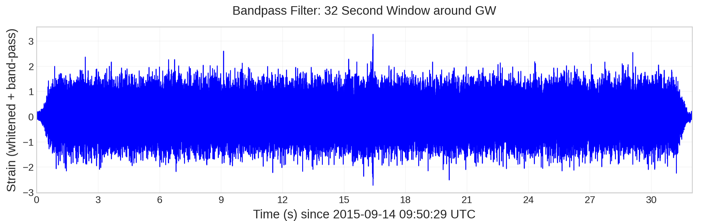  
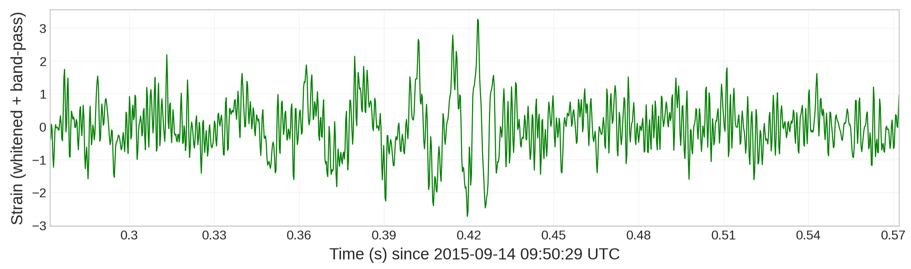

**How I made the plot:**
- After whitening the strain data, I applied a bandpass filter to keep a certain range of frequencies.
- I chose to keep frequencies between 30 and 400 Hz because this is the range where the gravitational-wave signal from a stellar-mass binary black hole merger, like GW150914, is strongest and also where LIGO is most sensitive. Low frequencies (<30 Hz) are dominated by seismic noise, while high frequencies (>400 Hz) are limited by laser shot noise.
- In Python, this is done with GWpy’s bandpass method.

**What the plot shows:**
- x-axis: time (seconds) around GW150914
- y-axis: strain (dimensionless, after whitening and filtering)
- The noise outside 30–400 Hz is removed, so the background looks much quieter.

**Interpretation:**  
- By keeping frequencies between about 30 and 400 Hz, most of the noise is removed while the gravitational-wave signal remains.
- The zoomed-in view shows just how brief and localized the merger signal is, highlighting the importance of filtering before further analysis.

---

## 5. Q-Transform

With FFts and ASDs, we can only see frequency information for fixed time intervals. To see how the signal's energy changes with both frequency and time, we use a Q-transform.

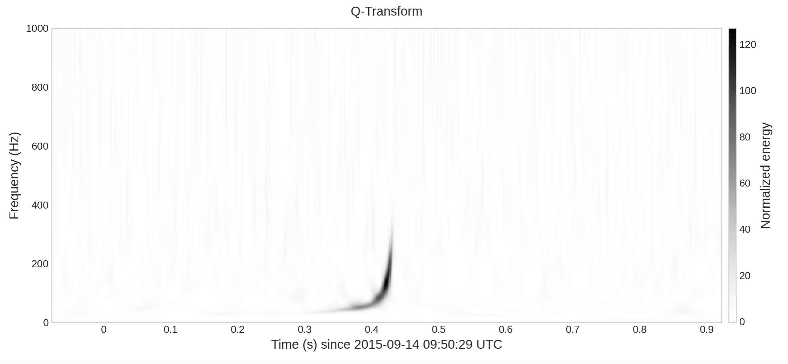

**How I made the plot:**
- Using the whitened strain data as input, I perform a Q-transform.
- A [Q-transform](https://medium.com/@shwongheiley/gw3-q-transform-a-time-frequency-analysis-for-gravitational-waves-d168ba21bb61) is similar to a short-time Fourier transform, but it uses windowed sinusoids with varying durations (Q-factor) to balance time and frequency resolution.
- Essentially, the Q-transform shows where and when the signal is strongest by highlighting bursts of energy at different frequencies over time, making it easier to spot gravitational waves.

**What the plot shows:**
- x-axis: time around the GW150914 merger (seconds)
- y-axis: frequency (Hz)
- Color: normalized energy at each time-frequency point

**Interpretation:**
- A clear “chirp” pattern appears: the frequency increases rapidly over a fraction of a second as the black holes spiral together. This matches very well with [black hole merger behavior](https://pmc.ncbi.nlm.nih.gov/articles/PMC5255899/) predicted by general relativity
- Compared to the raw or whitened time series, the Q-transform makes it much easier to identify the gravitational-wave event visually.

---

## 6. Analytic Model vs. Data

An analytic model predicts how the gravitational-wave frequency should change over time for a merging binary system. This is based on general relativity and the concept of chirp mass, which determines the rate at which the frequency increases as the black holes spiral together.

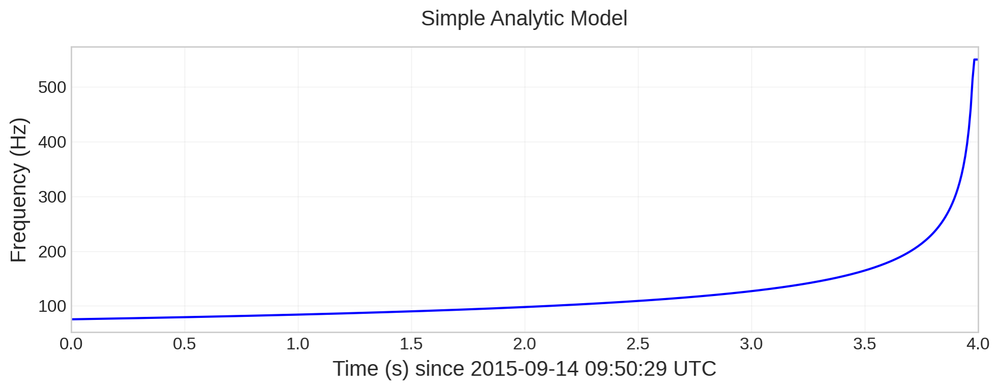  
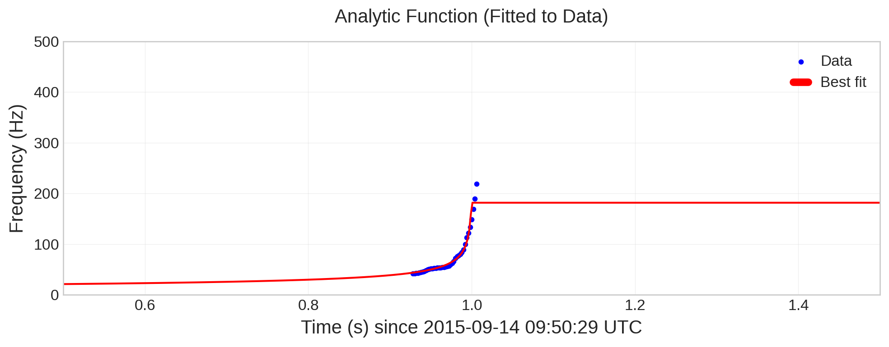

**How I made the plots:**  
- I used a simple frequency model, gwfreq(), to compute how the gravitational-wave frequency evolves over time for a binary system with a given chirp mass (iM = 25 solar masses).
- I took time samples from 0 to 4 seconds around the merger.
- I plotted the resulting frequency vs. time curve was plotted using matplotlib.
- Using lmfit, I fit the analytic model to the projected Q-transform data.

**What the plots show:**
- The analytical model shows a smooth, continuous curve of increasing frequency over time.
- The fitted curve shows that the analytic model accurately captures the chirp behavior seen in the data.

**Interpretation:**
- The increasing frequency over time is exactly what is expected from two massive objects spiraling together: the “chirp.”
- By fitting an analytic model to the Q-transform data, we can quantitatively confirm that the observed gravitational-wave signal matches the theoretical prediction from general relativity.
- This step links the raw strain data to the underlying physics, showing that the detected signal behaves exactly as predicted for a binary black hole merger.

---

## 7. Fitting an Oscillation Function

In this step, we fit an analytic waveform directly to the processed strain data in the time domain. Unlike earlier sections that focused on frequency evolution, this approach models the actual oscillations of the gravitational-wave signal near the merger.

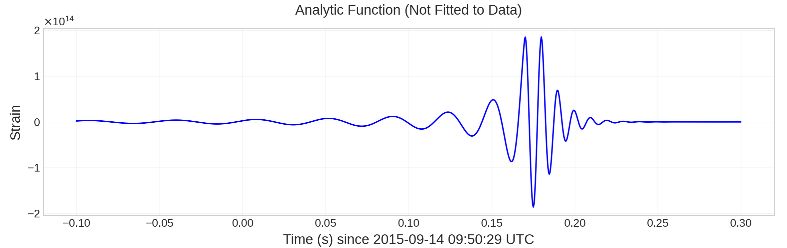  
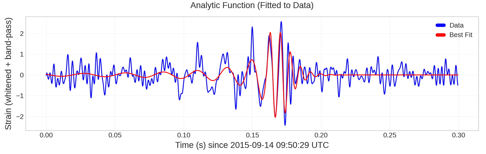

**How I made the plots:**  
1. Analytic waveform definition
- I defined an analytic function osc(t, …) to model the gravitational-wave strain.
- The function includes:
    - An increasing frequency from the earlier analytic chirp model "gwfreq()"
    - A cosine oscillation to represent the wave nature of the signal
    - An amplitude that grows as the merger approaches
    - A decaying exponential after the merger to mimic the ringdown ("settling down" after the merger)
    - This captures the key physical stages of a binary black hole merger: inspiral, merger, and ringdown.

2. Unfitted model plot
- I first plotted the analytic function using reasonable parameters from theoretical models, without fitting to data.
- This shows what a typical gravitational-wave–like signal looks like, but it is not yet matched to the observed strain.

3. Fitting to data
- I selected a short time window around the merger (≈ 0.3 seconds) from the whitened and bandpassed strain data.
- I used the lmfit library to adjust the model parameters (chirp mass, merger time, amplitude, phase, etc.) to minimize the difference between the model and the data.
- I plotted the best-fit analytic waveform on top of the data for direct comparison.

**What the plots show:**
- The fitted curve closely follows the oscillations and amplitude increase seen in the data near the merger. This indicates that the model captures the key features of the signal.

**Interpretation:**
- This step demonstrates that:
    - The oscillatory structure of the data matches that of a gravitational wave
    - The signal’s time-domain behavior can be explained using a physically motivated model
- Together with the frequency-based analyses (Q-transform and analytic chirp model), this provides strong evidence that the observed signal is a binary black hole merger, as predicted by general relativity.

---

## 8. Conclusion

Starting from noisy interferometer data, this analysis mimics the key steps used by LIGO to identify GW150914. Through filtering, time-frequency analysis, and modeling, a clear gravitational-wave signal from a binary black hole merger emerges.

This project follows the same overall ideas used by the LIGO team, but in a simplified way. The real LIGO analysis used extremely detailed computer-generated waveforms from general relativity and compared the data against thousands of templates, while I used simpler analytic models to demonstrate the key features of the signal.

LIGO also required the signal to be seen independently at multiple detectors to rule out local noise, whereas this project analyzes one detector at a time. In addition, the LIGO team performed extensive calibration, noise removal, and statistical tests to prove the signal was real, while this analysis focuses on understanding the physics and visually identifying the gravitational-wave chirp.

Not to mention, I knew the answer to the problem already, whereas the LIGO team was looking through many many candidate events. 

Even with these simplifications, the main structure of the GW150914 signal clearly emerges and matches theoretical expectations.

Big thanks again to Norm for guiding through this independent study!

### Notes / References
- MITxT 8.S50.1xComputational Data Science in Physics I
- LIGO Open Science Center: [https://losc.ligo.org](https://losc.ligo.org)  
- Analytical approximation references: Blanchet et al., PRL 1995 [link](https://journals.aps.org/prl/abstract/10.1103/PhysRevLett.74.3515)

